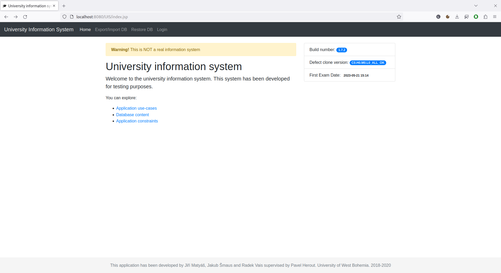
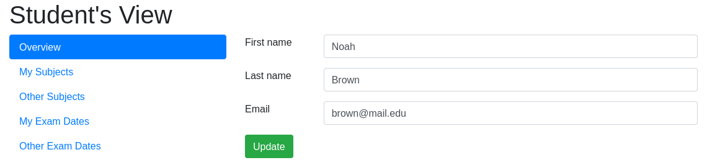
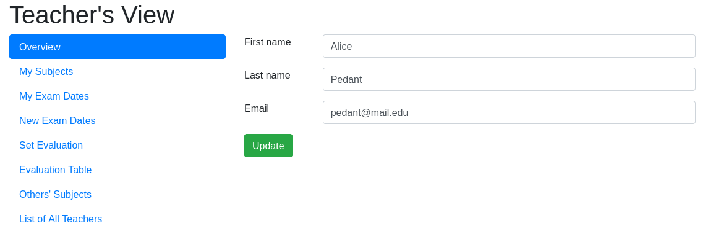
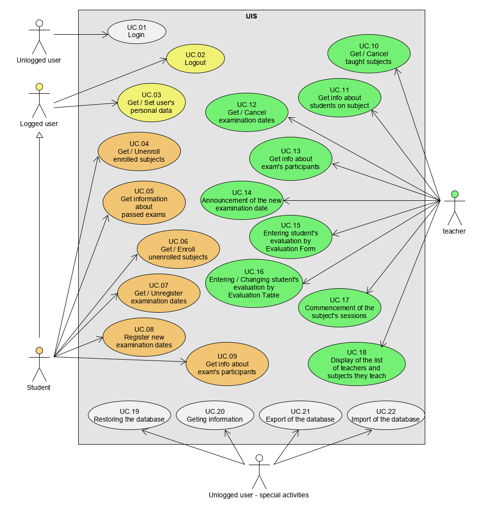
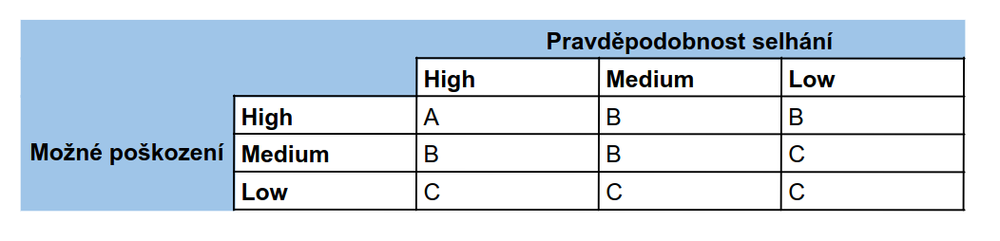
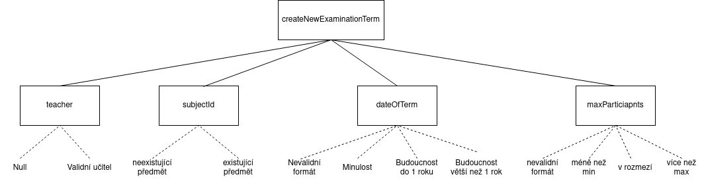
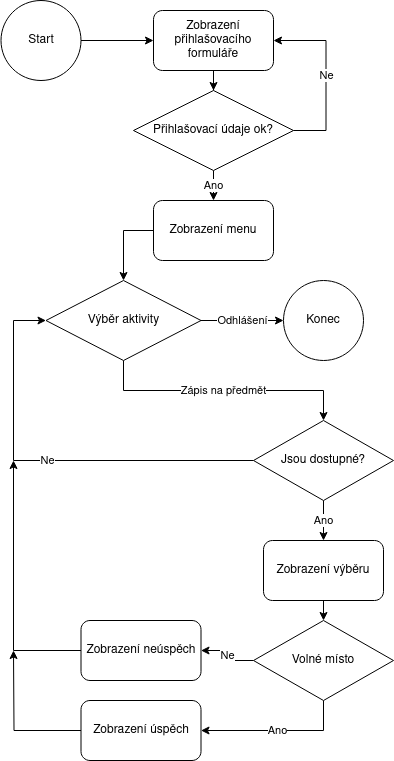
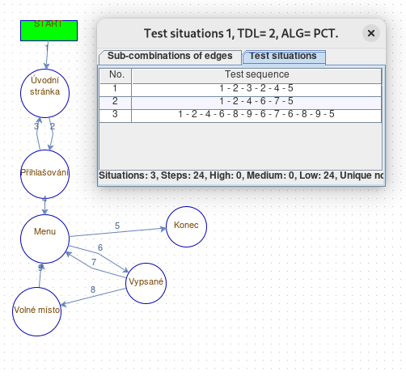
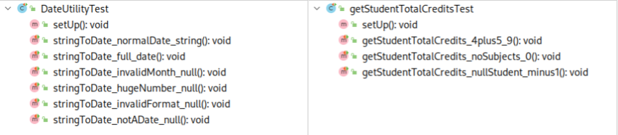
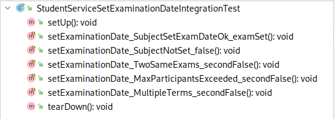

V tomto dokumentu popisuji testovanou aplikaci a testovací
scénáře v mojí semestrální práci. Semestrální práci jsem vytvářel sám.

Běžnou praxí v předmětu je otestování vlastního programu z předmětu Programování v Javě. Já ale nemám tuto možnost a tak jsem si na doporučení Miroslava Bureše vybral aplikaci [UIS](https://projects.kiv.zcu.cz/tbuis/web/) - University Information System.

Aplikace je vyvíjená a udržovaná výzkumnou skupinou [ReliSA](https://relisa.kiv.zcu.cz/) na Západočeké Univerzitě v Plzni. Jejím cílem je být semi-relalistickou platformou pro posuzování nových testovacích metod. Díky tomu je zdokumentovaná, má veřejně dostupné zdrojové kódy, je dostupná v řadě defektních verzí a existuje na ni široká paleta testů. Proto, aby měla tato práce nějaký smysl si ale samozřejmě napíšu vlastní.
 
## Popis aplikace
UIS je univerzitní informační systém sloužící studentům a učitelům, podobně jako KOS na ČVUT. Uživatelé s ním interagují pomocí webového rozhraní.

__Upozornění:__ Jako součást dokumentace je samozřejmě [popis aplikace](https://projects.kiv.zcu.cz/tbuis/web/page/uis). Ten jsem do této sekce přeložil, zpřehlednil a zkrátil.

Aplikace se skládá ze tří částí:

1. Správa  
   - slouží k základní údržbě DB systému a k získání informací o nastavení systému
   - dostupná bez přihlášení
    - v produkční verzi by přihlášení bylo třeba, zde zjednodušeno pro testování
2. Studentská část
3. Učitelská část

Aplikace je přednastavena s polorealistickými daty. Tato data jsou vybrána tak, aby pokryla téměř všechny možnosti různých nastavení, takže uživatel může s aplikací ihned experimentovat.

### Správa
Pro správu a údržbu aplikace je dostupných několik funkcí:

- __Restore DB__  
Tato činnost obnoví DB s výchozím nastavením.
- __Export/Import DB__  
Data lze exportovat a importovat do formátu XML nebo JSON.
- __Home - Informace o systému__  
Home page obsahuje následující užitečné informace:
  - Obsah databáze 
  - Případy použití (Use cases)
  - Omezení (Constrains)
  - Verze (Build number)
  - Označení defektní varianty
  - Datum a čas první zkoušky  

### Uživatelská část
Uživatelé se mohou do aplikace přihlásit pomocí jednotného přihlašovacího formuláře. Po úspěšném přihlášení je uživatel autorizován a přesměrován do příslušného zobrazení aplikace. Studenti a učitelé mají přístup do různých částí systému.

Počet uživatelů nelze po přihlášení měnit, např. přednastavení studenti a/nebo učitelé nemohou ukončit svou účast. Existuje pouze jediná možnost, jak přidat nebo odebrat studenty, učitele a předměty - restartovat aplikaci pomocí _Export/Import DB_.

#### Student
Představuje uživatele, který chce používat UIS jako student vysoké školy. Může si zapsat nebo odhlásit studované předměty a přihlásit se nebo odhlásit z termínu zkoušky ze zapsaných předmětů.

__Upozornění:__ Screenshoty ostatních stránek jsou ve složce _screenshots_.

#### Učitel
Představuje uživatele, který chce používat UIS jako vysokoškolský učitel. Učitel si může zapisovat a odhlašovat vyučované předměty a vytvářet a rušit termíny zkoušek. Učitel může také známkovat studenty účastnící se jím vytvořeného termínu zkoušky.

__Upozornění:__ Screenshoty ostatních stránek jsou ve složce _screenshots_.  

### Použité technologie
UIS je napsaný v Javě pomocí JavaServer Pages a Springu. Dále využívá Apache Tomcat jako webserver, MySQL nebo MariaDB databázi a Hibernate ORM pro komunikaci s databází.

## Přehled částí aplikace
Aplikace se skládá ze 3 hlavních částí a mnoha podčástí:

- __DAO (Data Access Objects)__ - zápis a komunikace s databází
  - ExaminationDateDao, GradeDao, GradeTypeDao, SubjectDao, UserDao
- __Services__ - provádění požadavků
  - PorterService
  - RestoreDBService
  - StudentService
  - TeacherService
  - UserService
- __Web controllers__ - komunikace s webovou aplikací
  - Student
    - ExamDatesController 
    , RegisterExamDatesController
    , RegisterSubjectListController
    , SubjectListController
  - Teacher
     - EvaluationTableController, ListOfAllTeachersController
     , ListOfNotTaughtSubjectController
     , ListOfTaughtSubjectController
     , NewExamDateController
     , NewGradeController
     , TeachersExamTermsController
  - ImportExportController
  - LoginController
  - OverviewController
  - RestoreDbController

Další části __annotations__, __config__, __domain__ a __utils__ jsou pomocné.

## Prioritizace částí aplikace
Požadavky uživatelů jsou znázorněné na use-case diagramu:

Různé use casy jsou pro uživatele samozřejmě různě důležité. Tuto informaci bychom získali rozhovory se zákazníky a budoucími uživateli.  

__Vysoká důležitost:__  

- UC.01 Přihlášení
- UC.14 Oznámení nového zkouškového data
- UC.08 Registrace na novou zkoušku
- UC.06 Výpis, zápis a odhlášení předmětu

__Střední důležitost:__

- UC.12 Výpis a zrušení zkoušky
- UC.15 a UC.16 Zapsání a změna známky
- UC.05 Výpis známek z absolvovaných zkoušek
- UC.21 Exportování databáze

Ostatní use casy mají nízkou důležitost.

V aplikaci odpovídá každému požadavku přibližně jeden proces.

## Test levels

## Testovací scénáře
### Testy vstupů
Přestože se jedná o relativně sofistikovanou aplikaci, tak byl problém najít nějaký netriviální vstup. Nakonec jsem se rozhodl pro metodu `createNewExaminationTerm`, která slouží k vytvoření nového termínu zkoušky.

~~~{.java}
public boolean createNewExaminationTerm(Teacher teacher, Long subjectId, String dateOfTerm, String maxParticipants)
~~~

#### Třídy ekvivalence
Metodě odpovídá následující diagram tříd ekvivalence:

- _teacher_ a _subjectId_ jsou diskrétní hodnoty
- u _dateOfTerm_ je vyhodnocení výrazu navázané na současné datum. Označím současné datum jako `now()` a _dateOfTerm_ jako `d`. Pro validní formát data platí následující rozdělení:
  - d <= now()
  - d > now() & d <= now() + 1 rok
  - d > now() + 1 rok
  - __Boundary values:__ now(), now() + 1s, now() + 1 rok, now() + 1 rok + 1s 
- u _maxParticipants_ se hodnota min a max definuje v konfiguračním souboru. Pro defaultní hodnoty - min: 1, max: 10 a validní formát platí následující rozdělení (_maxParticipants_ = `mp`)
  - mp < 1
  - mp >= 1 & mp <= 10
  - mp > 10
  - __Boundary values:__ 0, 1, 10, 11

#### Pairwise testing
Vložením hodnot do ACTS a spuštěním generátoru pairwise kombinací získáme následující:

| číslo kombinace | teacher | subjectId | dayOfTerm | maxParticipants |
|---|---|---|---|---|
| 1 | valid | NEexistující | invalid format | invalid format |
| 2 | null | existující | invalid format | < min |
| 3 | valid | existující | invalid format | >= min & <= max |
| 4 | null | NEexistující | invalid format | > max |
| 5 | null | existující | <= now() | invalid format |
| 6 | valid | NEexistující | <= now() | < min |
| 7 | null | NEexistující | <= now() | >= min & <= max |
| 8 | valid | existující | <= now() | > max |
| 9 | null | NEexistující | > now() & <= now() + 1 rok | invalid format |
| 10 | valid | existující | > now() & <= now() + 1 rok | < min |
| 11 | valid | NEexistující | > now() & <= now() + 1 rok | >= min & <= max |
| 12 | null | NEexistující | > now() & <= now() + 1 rok | > max |
| 13 | null | NEexistující | > now() + 1 rok | invalid format |
| 14 | valid | existující | > now() + 1 rok | < min |
| 15 | valid | existující | > now() + 1 rok | >= min & <= max |
| 16 | valid | existující | > now() + 1 rok | > max |

### Testy průchodu
Vytvořil jsem diagram pro proces _Zápis předmětu studentem_.

A k němu v Oxygenu vygeneroval procesní testy s TLD 2.

### Detailní testovací scénář

|Parametr|Obsah|
|:----|:----|
|ID testu|TeaEt01|
|Název testu|Hodnocení studentů v tabulce|
|Hloubka detailu|Střední|
|Shrnutí testu|Hodnocení více studentů, pozitivní průchod|
|Popis testu|Přihlášený učitel vybere předmět k hodnocení. Zobrazí se tabulka vypsaných zkoušek s registrovanými studenty. Učitel studenty ohodnotí. Hodnocení se do systému uloží a zůstane zachované při dalším otevření hodnotící tabulky.|
|Vstupní podmínky|Přihlášený učitel učící Database Systems   Dva vypsaný termín zkoušky   2 a 3 registrovaní studenti na každou zkoušku|
|Testovací data|Známky: A, B, B, C, E|
|Očekávaný výsledek|Zobrazí se hláška "Sucess" a hodnocení se propíše do databáze.|

## Implementace testů
Aplikace je napsaná v neaktuální verzi Springu (4.3.2) a proto jsem se rozhodl použít i neaktuální JUnit ve verzi 4.12. Na základní unit testy by šlo použít i nejnovější JUnit, ale pro integrační testy, ve kterých už se se Spring interaguje, je potřeba použít starší verzi.

### Unit testy
Požadavaných 5 Unit testů je v kontextu aplikace málo. Otestoval jsem s nimi _BaseDateUtility_ a částečně _BaseStudentService_. Ve všech testech je použito mockito.

### Integrační testy
Integrační testy jsem prováděl opět na tříde `BaseStudentService`. Na rozdíl od Unit testů jsem nemockoval komunikaci s databází, ale používal skutečnou komunikaci.

