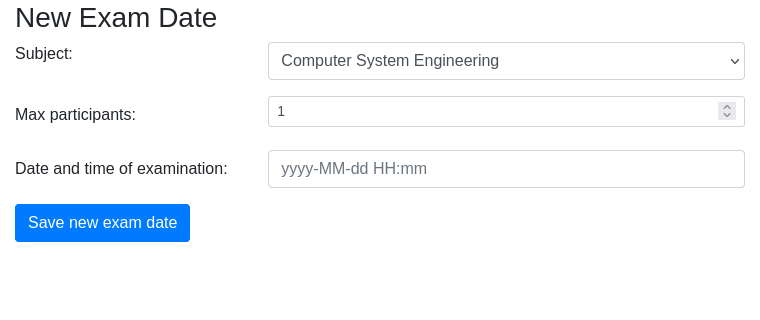

# TS1 Semestrální práce - UIS
V tomto dokumentu popisuji testovanou aplikaci a testovací
scénáře v mojí semestrální práci. Semestrální práci jsem vytvářel sám.

Běžnou praxí v předmětu je otestování vlastního programu z předmětu Programování v Javě. Já ale nemám tuto možnost a tak jsem si na doporučení Miroslava Bureše vybral aplikaci [UIS](https://projects.kiv.zcu.cz/tbuis/web/) - University Information System.

Aplikace je vyvíjená a udržovaná výzkumnou skupinou [ReliSA](https://relisa.kiv.zcu.cz/) na Západočeké Univerzitě v Plzni. Jejím cílem je být semi-relalistickou platformou pro posuzování nových testovacích metod. Díky tomu je zdokumentovaná, má veřejně dostupné zdrojové kódy, je dostupná v řadě defektních verzí a existuje na ni široká paleta testů. Proto, aby měla tato práce nějaký smysl je ale nebudu kopírovat a budu si psát vlastní.
 
## Popis aplikace
UIS je univerzitní informační systém sloužící studentům a učitelům, podobně jako KOS na ČVUT. Uživatelé s ním interagují pomocí webového rozhraní.

__Upozornění:__ Jako součást dokumentace je samozřejmě [popis aplikace](https://projects.kiv.zcu.cz/tbuis/web/page/uis). Ten jsem do této sekce přeložil, zpřehlednil a zkrátil.

Aplikace se skládá ze tří částí:

1. Správa  
   - slouží k základní údržbě DB systému a k získání informací o nastavení systému
   - dostupná bez přihlášení
    - v produkční verzi by přihlášení bylo třeba, zde zjednodušeno pro testování
2. Studentská část
3. Učitelská část

Aplikace je přednastavena s polorealistickými daty. Tato data jsou vybrána tak, aby pokryla téměř všechny možnosti různých nastavení, takže uživatel může s aplikací ihned experimentovat.

### Správa
Pro správu a údržbu aplikace je dostupných několik funkcí:

- __Restore DB__  
Tato činnost obnoví DB s výchozím nastavením.
- __Export/Import DB__  
Data lze exportovat a importovat do formátu XML nebo JSON.
- __Home - Informace o systému__  
Home page obsahuje následující užitečné informace:
  - Obsah databáze 
  - Případy použití (Use cases)
  - Omezení (Constrains)
  - Verze (Build number)
  - Označení defektní varianty
  - Datum a čas první zkoušky  

### Uživatelská část
Uživatelé se mohou do aplikace přihlásit pomocí jednotného přihlašovacího formuláře. Po úspěšném přihlášení je uživatel autorizován a přesměrován do příslušného zobrazení aplikace. Studenti a učitelé mají přístup do různých částí systému.

Počet uživatelů nelze po přihlášení měnit, např. přednastavení studenti a/nebo učitelé nemohou ukončit svou účast. Existuje pouze jediná možnost, jak přidat nebo odebrat studenty, učitele a předměty - restartovat aplikaci pomocí _Export/Import DB_.

#### Student
Představuje uživatele, který chce používat UIS jako student vysoké školy. Může si zapsat nebo odhlásit studované předměty a přihlásit se nebo odhlásit z termínu zkoušky ze zapsaných předmětů.

__Upozornění:__ Screenshoty ostatních stránek jsou ve složce _screenshots_.

#### Učitel
Představuje uživatele, který chce používat UIS jako vysokoškolský učitel. Učitel si může zapisovat a odhlašovat vyučované předměty a vytvářet a rušit termíny zkoušek. Učitel může také známkovat studenty účastnící se jím vytvořeného termínu zkoušky.

__Upozornění:__ Screenshoty ostatních stránek jsou ve složce _screenshots_.  

### Použité technologie
UIS je napsaný v Javě pomocí JavaServer Pages a Springu. Dále využívá Apache Tomcat jako webserver, MySQL nebo MariaDB databázi a Hibernate ORM.

## Části aplikace

## Prioritizace částí aplikace
Požadavky uživatelů jsou znázorněné na use-case diagramu:
![use case diagram, (zdroj)[https://projects.kiv.zcu.cz/tbuis/web/page/uis]](./img/use-case.png)

Různé use casy jsou pro uživatele samozřejmě různě důležité. Tuto informaci bychom získali rozhovory se zákazníky a budoucími uživateli. Jelikož nemám tuto možnost a téma je mi jako studentovi blízké, tak jsem ji odhadl.  
__Vysoká důležitost:__  

- UC.01 Přihlášení
- UC.14 Oznámení nového zkouškového data
- UC.08 Registrace na novou zkoušku
- UC.06 Výpis, zápis a odhlášení předmětu

__Střední důležitost:__

- UC.12 Výpis a zrušení zkoušky
- UC.15 a UC.16 Zapsání a změna známky
- UC.05 Výpis známek z absolvovaných zkoušek
- UC.21 Exportování databáze

Ostatní use casy mají nízkou důležitost.

## Testovací scénáře
### Testy vstupů
Přestože se jedná o relativně sofistikovanou aplikaci, tak byl problém najít nějaký netriviální vstup. Nakonec jsem se rozhodl pro metodu `createNewExaminationTerm`, která slouží k vytvoření nového termínu zkoušky.

~~~{.java}
public boolean createNewExaminationTerm(Teacher teacher, Long subjectId, String dateOfTerm, String maxParticipants)
~~~

Jako vstup aplikace jsem se rozhodl otestovat formulář na vytvoření nového termínu zkoušky.  

Formulář obsahuje 2 uživatelsky zadatelné vstupy - _max pariticipants_ a _date and time_ a jeden skrytý vstup - _počet vypsaných zkoušek_, který se zahrnuje do vyhodnocení výrazu a zjistí se z hodnoty _subject_.

#### Třídy ekvivalence

__Max participants__  
Maximální počet účastníků zkoušky musí být větší než 0 a zároveň menší než školní limit, který je v systému nastavený. V základu je 10.

__Počet vypsaných zkoušek__  
Počet vypsaných zkoušek v předmětu je limitovaný danou hodnotou v systému (default je 3). Pokud jsme limitu dosáhli, nemůžeme vytvořit novou zkoušku.

Počet vypsaných zkoušek je vždý kladné celé číslo a tak nemusíme brát v potaz záporné hodnoty.

__Datum__  
Datum je nejkomplikovanější vstupní parametr. Zadává se jako string a musí splňovat 3 podmínky:

1. validní formát
2. datum je v budoucnosti bližší než 1 rok
3. dvě zkoušky musí být od sebe dál než 24h

#### Pairwise testing

### Testy průchodu
Vytvořil jsem diagram pro proces Zápis předmětu studentem.

A k němu v Oxygenu vygeneroval procesní testy s TLD 2.

### Detailní testovací scénář

|Parametr|Obsah|
|:----|:----|
|ID testu|TeaEt01|
|Název testu|Hodnocení studentů v tabulce|
|Hloubka detailu|Střední|
|Shrnutí testu|Hodnocení více studentů, pozitivní průchod|
|Popis testu|Přihlášený učitel vybere předmět k hodnocení. Zobrazí se tabulka vypsaných zkoušek s registrovanými studenty. Učitel studenty ohodnotí. Hodnocení se do systému uloží a zůstane zachované při dalším otevření hodnotící tabulky.|
|Vstupní podmínky|Přihlášený učitel učící Database Systems   Dva vypsaný termín zkoušky   2 a 3 registrovaní studenti na každou zkoušku|
|Testovací data|Známky: A, B, B, C, E|
|Očekávaný výsledek|Zobrazí se hláška "Sucess" a hodnocení se propíše do databáze.|

### Unit testy
Požadavaných 5 Unit testů je v kontextu aplikace velmi málo. Proto jsem otestoval _BaseDateUtility_ a částečně _BaseStudentService_.

Ve všech testech je použito mockování.

### Integrační testy

